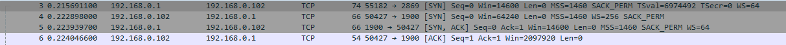
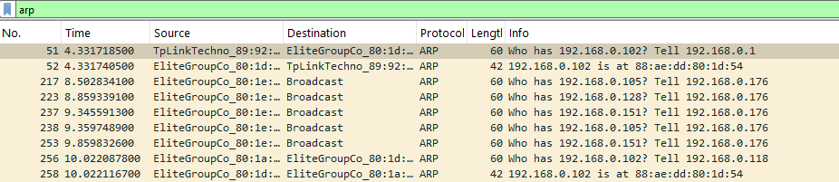
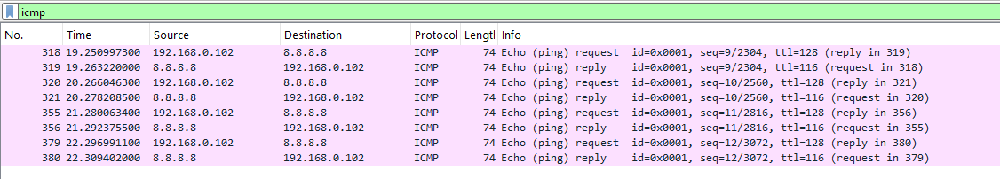
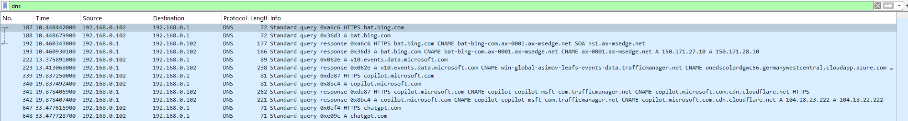
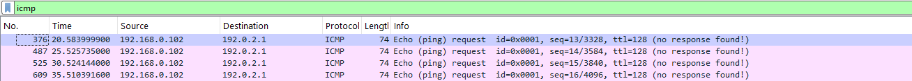

# Wireshark Network Traffic Analysis


A hands-on Wireshark project focused on capturing and analyzing common network protocols and using packet evidence for basic connectivity troubleshooting.

## Overview

This project demonstrates practical packet-analysis skills using:

- **TCP** — Three-way connection establishment: SYN → SYN/ACK → ACK
- **ARP** — Local IPv4 address-to-MAC address resolution
- **ICMP** — Echo Request/Reply traffic for connectivity verification
- **DNS** — Standard DNS query and response traffic
- **ICMP Troubleshooting** — Controlled analysis of an unreachable documentation address

## Analysis Performed

### 1. TCP Three-Way Handshake

Captured and identified the TCP connection-establishment sequence:

```
SYN → SYN/ACK → ACK
```

Wireshark filter:

```
tcp.flags.syn == 1
```

**Evidence:**



---

### 2. ARP Request and Reply

Captured an ARP request and corresponding reply to observe local address resolution.

Example flow:

```
Who has <IP>? Tell <IP>
<IP> is at <MAC>
```

Wireshark filter:

```
arp
```

**Evidence:**



---

### 3. ICMP Connectivity Analysis

Captured ICMP Echo Request and Echo Reply packets during a successful connectivity test.

Wireshark filter:

```
icmp
```

**Evidence:**



---

### 4. DNS Query and Response

Captured and inspected DNS query and response traffic generated during a hostname lookup.

Wireshark filter:

```
dns
```

**Evidence:**



---

### 5. Controlled ICMP Troubleshooting

Tested connectivity to the documentation-only address `192.0.2.1`. The test produced no Echo Replies, providing packet-level evidence of a connectivity failure.

Observed result:

- ICMP Echo Requests were transmitted
- No Echo Replies were received
- Ping reported 100% packet loss

**Evidence:**



---

## Tools & Skills

- Wireshark
- Packet Capture & Analysis
- TCP/IP
- TCP Three-Way Handshake
- ARP
- ICMP
- DNS
- Network Troubleshooting
- Wireshark Display Filters

## Project Evidence

The project is based on hands-on packet captures performed in a lab environment. The repository contains selected screenshots as public evidence. Raw `.pcapng` capture files are kept separately rather than published.

## Learning Outcomes

- Identify common packet flows at the protocol level
- Use Wireshark display filters to isolate traffic
- Recognize TCP connection establishment
- Interpret ARP, ICMP, and DNS packets
- Use packet captures as evidence during basic network troubleshooting
